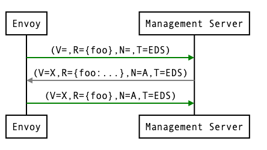
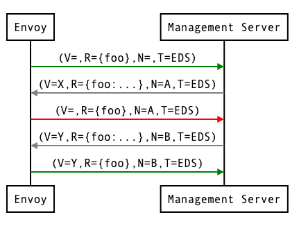

# 协议概述

## 资源类型

v3版本xDS支持的资源有：
* envoy.config.listener.v3.Listener
* envoy.config.route.v3.RouteConfiguration,
* envoy.config.route.v3.ScopedRouteConfiguration,
* envoy.config.route.v3.VirtualHost
* envoy.config.cluster.v3.Cluster
* envoy.config.endpoint.v3.ClusterLoadAssignment
* envoy.extensions.transport_sockets.tls.v3.Secret
* envoy.service.runtime.v3.Runtime

type URLs遵循这样的格式`type.googleapis.com/<resource type>`

## Filesystem subscriptions

```
message ConfigSource {

  oneof config_source_specifier {

    // Local filesystem path configuration source.
    PathConfigSource path_config_source = 8;

    // API configuration source.
    ApiConfigSource api_config_source = 2;

    // When set, ADS will be used to fetch resources. The ADS API configuration
    // source in the bootstrap configuration is used.
    AggregatedConfigSource ads = 3;

  }
}
```

可以通过`ConfigSource`中的`path_config_source`指定配置文件。envoy会监听文件变更以进行配置更新。


## Streaming gRPC subscriptions

### API flow

在经典的HTTP路由的场景，关键的资源类型为 `Listener` --> `RouterConfiguration` --> `Cluster` --> `ClusterLoadAssignment`。envoy启动后会首先拉取`Listener`和`Cluster`，然后根据其返回分别拉取`RouterConfiguration`和`ClusterLoadAssignment`。

对于non-proxy客户端，例如gRPC，首先仅仅会拉取指定的`Listener`，然后拉取相关的`RouteConfiguration`，再然后是`Cluster`，最后是`ClusterLoadAssignment`。


### Variants of the xDS Transport Protocol

**四个变种**

* State of the World (Basic xDS): SotW, separate gRPC stream for each resource type
* Incremental xDS: incremental, separate gRPC stream for each resource type
* Aggregated Discovery Service (ADS): SotW, aggregate stream for all resource types
* Incremental ADS: incremental, aggregate stream for all resource types


**各个变种的RPC服务和方法**

non-aggregated protocol

* Listener: Listener Discovery Service (LDS)
  * SotW: ListenerDiscoveryService.StreamListeners
  * Incremental: ListenerDiscoveryService.DeltaListeners
* RouteConfiguration: Route Discovery Service (RDS)
  * SotW: RouteDiscoveryService.StreamRoutes
  * Incremental: RouteDiscoveryService.DeltaRoutes
* ScopedRouteConfiguration: Scoped Route Discovery Service (SRDS)
  * SotW: ScopedRouteDiscoveryService.StreamScopedRoutes
  *Incremental: ScopedRouteDiscoveryService.DeltaScopedRoutes
* VirtualHost: Virtual Host Discovery Service (VHDS)
  * SotW: N/A
  * Incremental: VirtualHostDiscoveryService.DeltaVirtualHosts
* Cluster: Cluster Discovery Service (CDS)
  * SotW: ClusterDiscoveryService.StreamClusters
  * Incremental: ClusterDiscoveryService.DeltaClusters
* ClusterLoadAssignment: Endpoint Discovery Service (EDS)
  * SotW: EndpointDiscoveryService.StreamEndpoints
  * Incremental: EndpointDiscoveryService.DeltaEndpoints
* Secret: Secret Discovery Service (SDS)
  * SotW: SecretDiscoveryService.StreamSecrets
  * Incremental: SecretDiscoveryService.DeltaSecrets
* Runtime: Runtime Discovery Service (RTDS)
  * SotW: RuntimeDiscoveryService.StreamRuntime
  * Incremental: RuntimeDiscoveryService.DeltaRuntime

aggregated protocol

* SotW: AggregatedDiscoveryService.StreamAggregatedResources
* Incremental: AggregatedDiscoveryService.DeltaAggregatedResources

**配置使用哪个变种**

`ConfigSource`中的`ApiConfigSource`指定使用单独的变种，`AggregatedConfigSource`指定使用聚合的变种。

**客户端配置**

当前Envoy限制xDS Cluster资源必须在static_resources中首先定义。

对于使用xDS的gRPC客户端，只有ADS是支持的。

### The xDS transport Protocol


客户端发送`DiscoveryRequest`：
```proto3
message DiscoveryRequest {
  string version_info = 1;

  config.core.v3.Node node = 2;

  repeated string resource_names = 3;
  repeated ResourceLocator resource_locators = 7;

  string type_url = 4;

  string response_nonce = 5;

  google.rpc.Status error_detail = 6;
}
```

服务端回复`DiscoveryResponse`：
```proto3
message DiscoveryResponse {
  string version_info = 1;

  repeated google.protobuf.Any resources = 2;

  bool canary = 3;

  string type_url = 4;

  string nonce = 5;

  config.core.v3.ControlPlane control_plane = 6;
}
```

**ACK**

回复V=X表示接受配置。



**NACK**

如果不接受配置，那么客户端回复NACK，也就是附上`error_detail`。



每种resource type对应一个版本号。

**总结**
* xDS客户端必须`ACK`或者`NACK`每一个`DiscoveryResponse`，`response_nonce`关联对应的响应。
* ACK标识成功的配置。
* NACK标识失败的配置，并且在`error_detail`中带上详细信息。`version_info`标识最新使用的版本。

**客户端如何指定返回的资源**

xDS请求运行客户端指定一组资源。SotW协议在`resource_names`字段指定；增量协议通过`e resource_names_subscribe`和`resource_names_unsubscribe`这两个字段指定。

Listener和Cluster这两种资源类型可以通配（*）订阅，此类情况通常基于客户端的`node`标识返回资源。

**客户端行为**
* Envoy通常是通配订阅Listener和Cluster资源
* 使用xDS的gRPC客户端通常只用一个listener配置，并且出口配置的资源也是明确的。

### Resource warming

**最终一致性**

请求顺序：
* CDS updates (if any) must always be pushed first.
* EDS updates (if any) must arrive after CDS updates for the respective clusters.
* LDS updates must arrive after corresponding CDS/EDS updates.
* RDS updates related to the newly added listeners must arrive after CDS/EDS/LDS updates.
* VHDS updates (if any) related to the newly added RouteConfigurations must arrive after RDS updates.
* Stale CDS clusters and related EDS endpoints (ones no longer being referenced) can then be removed.

### Aggregated Discovery Service

一个stream，保证上述请求顺序。

### Incremental xDS

//todo

## REST-JSON polling subscriptions

//todo


