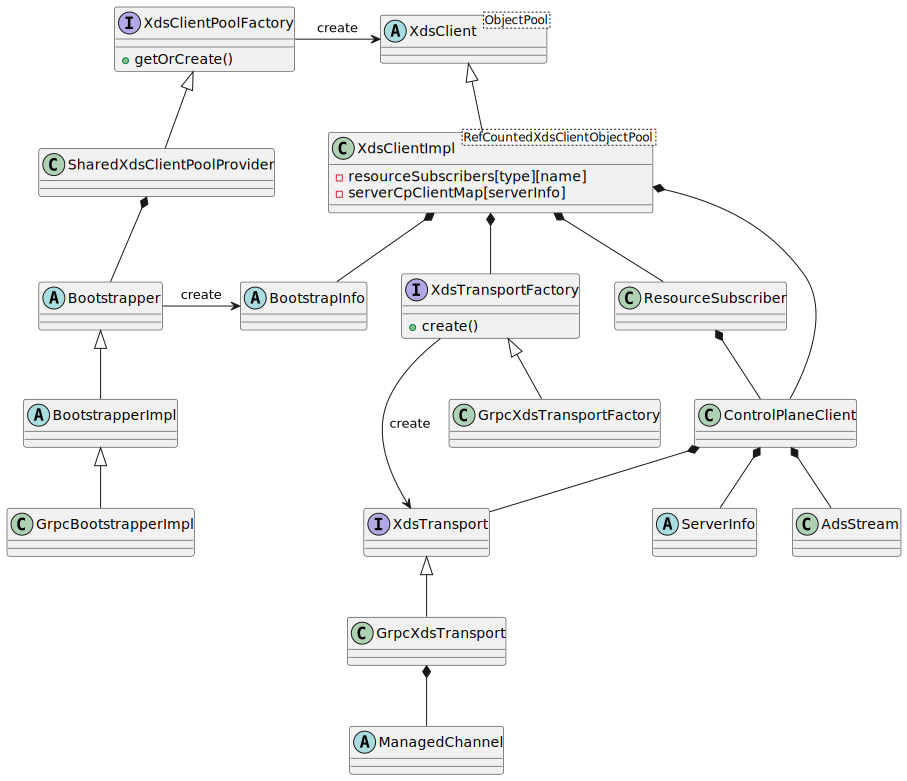

# XdsNameResolver(Java)

Java版本的grpc-xds使用的是ADS，资源的调用顺序与[envoy文档](https://www.envoyproxy.io/docs/envoy/latest/api-docs/xds_protocol#eventual-consistency-considerations)略有区别。

在`ManagedChannel`中`NameResolver`的起始方法是start，所以首先从`XdsNameResolver`的start方法开始。

```java
  @Override
  public void start(Listener2 listener) {
    this.listener = checkNotNull(listener, "listener");
    try {
      xdsClientPool = xdsClientPoolFactory.getOrCreate();
    } catch (Exception e) {
      listener.onError(
          Status.UNAVAILABLE.withDescription("Failed to initialize xDS").withCause(e));
      return;
    }
    xdsClient = xdsClientPool.getObject();
    BootstrapInfo bootstrapInfo = xdsClient.getBootstrapInfo();
    String listenerNameTemplate;
    if (targetAuthority == null) {
      listenerNameTemplate = bootstrapInfo.clientDefaultListenerResourceNameTemplate();
    } else {
      AuthorityInfo authorityInfo = bootstrapInfo.authorities().get(targetAuthority);
      if (authorityInfo == null) {
        listener.onError(Status.INVALID_ARGUMENT.withDescription(
            "invalid target URI: target authority not found in the bootstrap"));
        return;
      }
      listenerNameTemplate = authorityInfo.clientListenerResourceNameTemplate();
    }
    String replacement = serviceAuthority;
    if (listenerNameTemplate.startsWith(XDSTP_SCHEME)) {
      replacement = XdsClient.percentEncodePath(replacement);
    }
    String ldsResourceName = expandPercentS(listenerNameTemplate, replacement);
    if (!XdsClient.isResourceNameValid(ldsResourceName, XdsListenerResource.getInstance().typeUrl())
        ) {
      listener.onError(Status.INVALID_ARGUMENT.withDescription(
          "invalid listener resource URI for service authority: " + serviceAuthority));
      return;
    }
    ldsResourceName = XdsClient.canonifyResourceName(ldsResourceName);
    callCounterProvider = SharedCallCounterMap.getInstance();
    resolveState = new ResolveState(ldsResourceName);
    resolveState.start();
  }
```

这里构建了两个重要的对象：
1. xdsClient 封装与xDS server的交互逻辑
2. bootstrapInfo 上述客户端的配置信息

设计文档在[gRPC A27](https://github.com/grpc/proposal/blob/master/A27-xds-global-load-balancing.md)，具体的类图如下：



## Bootstrapper


